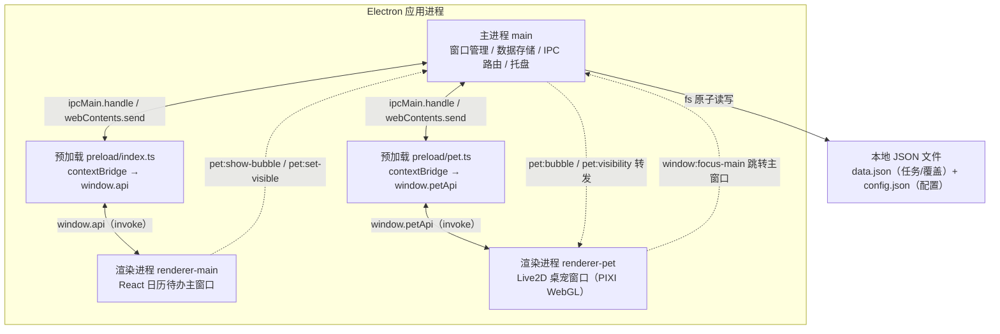
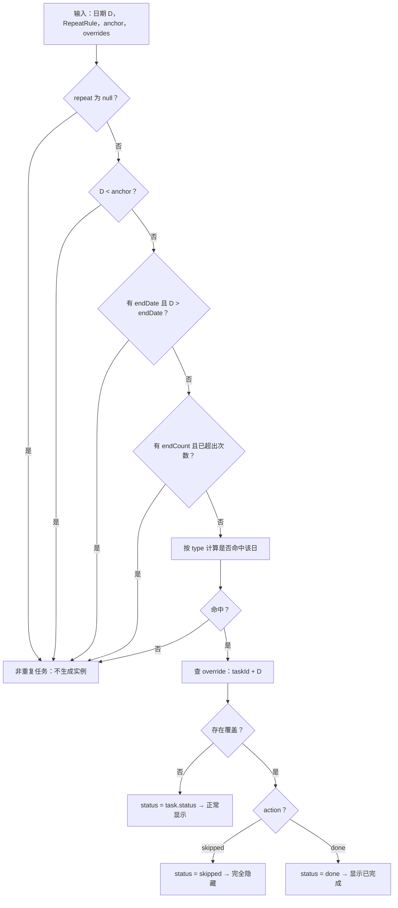
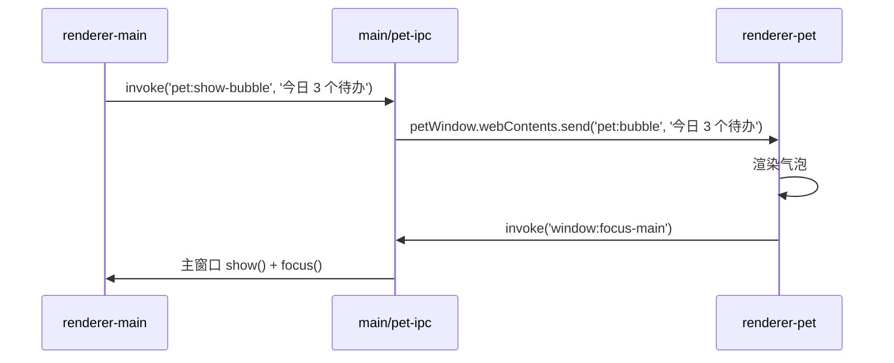
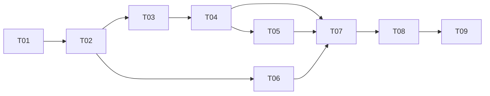

# Fantacy Todo List — 系统架构设计 + 任务拆解

> 版本：v1.0
> 架构师：高见远
> 依据文档：`docs/01-PRD.md`（v1.0）
> 技术栈（已确认，不可变更）：Electron + React 18 + Vite + TypeScript + Tailwind CSS + pixi-live2d-display

---

## 0. 设计总览（TL;DR）

- **进程模型**：1 个主进程（main）+ 2 个预加载（preload/index、preload/pet）+ 2 个渲染进程（renderer-main 日历主窗口、renderer-pet 桌宠窗口）。
- **构建工具**：采用 `electron-vite`（统一编排 main / preload / renderer 三端构建，支持多渲染入口），打包用 `electron-builder`。
- **数据**：`%APPDATA%\fantacy-todo-list-react\fantacy-todo-list\` 下拆分 `data.json`（任务+覆盖）与 `config.json`（应用配置），主进程用「临时文件 + rename」原子写。
- **状态**：渲染进程用 Zustand 分三 store（task / config / ui），数据权威源在 main 进程，经 IPC 单向同步。
- **重复任务**：纯函数引擎 `repeatEngine`，根据 RepeatRule 推算命中 + RepeatOverride 覆盖，可独立单测。
- **桌宠**：透明无边框置顶 BrowserWindow，PIXI + pixi-live2d-display 渲染「日和 Hiyori」，资源本地打包完全离线。

---

## 1. 总体架构

### 1.1 进程与 IPC 通信关系



### 1.2 关键设计决策

| 决策点 | 方案 | 理由 |
| --- | --- | --- |
| 构建编排 | `electron-vite` | 一套配置统一编译 main/preload/renderer，天然支持多 HTML 入口（双渲染进程），HMR 体验好 |
| 渲染进程拆分 | 两个独立渲染入口（main + pet） | 桌宠窗口与主窗口职责、生命周期、安全策略完全不同，隔离后互不拖累 |
| 数据权威源 | main 进程 `store.ts` | 所有写操作经 IPC 收敛到主进程，保证单写者 + 原子写，避免双窗口并发写坏文件 |
| 状态管理 | Zustand（3 个 store） | 轻量、无样板；与 IPC 单向数据流配合，渲染进程只做「快照 + 本地派生」 |
| 类型共享 | `src/shared/` 目录 | main / preload / renderer / pet 四方复用同一套类型与 IPC channel 常量，避免漂移 |
| 拖拽 | @dnd-kit | 支持日历拖拽改期 + 收集箱 sortable 排序，可访问性与移动端友好（虽桌面但代码干净） |
| 撒花 | canvas-confetti | 零依赖、轻量、Canvas 实现 |
| 日期 | date-fns | 树摇友好，处理周起始/格式化方便 |
| Live2D | pixi-live2d-display（PIXI v7） | 成熟社区方案，支持 Cubism 4 模型；**注意必须用 pixi.js v7，不支持 v8** |

---

## 2. 目录结构

> 项目根目录：`C:\Users\29951\Desktop\日历清单\fantacy-todo-list\`

```
fantacy-todo-list/
├── package.json
├── electron.vite.config.ts        # main / preload / renderer(main+pet) 三端配置
├── electron-builder.yml           # 打包配置（nsis，卸载保留用户数据）
├── tsconfig.json                  # 引用两个子 tsconfig
├── tsconfig.node.json             # main + preload + shared
├── tsconfig.web.json              # renderer + pet + shared
├── tailwind.config.js             # darkMode: 'media'
├── postcss.config.js
├── .npmrc
├── .gitignore
├── resources/
│   └── icon.ico                   # 应用图标
├── scripts/
│   └── copy-live2d-assets.mjs     # 从 node_modules 拷贝 hiyori 模型 → src/pet/public/live2d
├── src/
│   ├── shared/                    # 四方共享（纯类型/常量，无运行时依赖）
│   │   ├── types.ts               # Task / RepeatRule / RepeatOverride / AppConfig / FullData
│   │   ├── ipc-channels.ts        # IPC channel 名常量
│   │   └── defaults.ts            # 默认 AppConfig、默认 data、优先级枚举映射
│   ├── main/                      # 主进程
│   │   ├── index.ts               # 入口：app 生命周期、初始化 store、注册 IPC、创建窗口
│   │   ├── windows.ts             # 主窗口 + 桌宠窗口工厂（BrowserWindow 配置）
│   │   ├── tray.ts                # 系统托盘（隐藏/唤出桌宠、显示主窗口、退出）
│   │   ├── store.ts               # JSON 读写 + 原子写 + 防抖 config 写
│   │   ├── ipc.ts                 # 数据类 IPC handler（task/config/override）
│   │   └── pet-ipc.ts             # 桌宠/窗口类 IPC handler（bubble/visibility/focus）
│   ├── preload/
│   │   ├── index.ts               # 主窗口 preload → window.api
│   │   └── pet.ts                 # 桌宠窗口 preload → window.petApi
│   ├── renderer/                  # ====== 主窗口（日历待办）======
│   │   ├── index.html
│   │   └── src/
│   │       ├── main.tsx
│   │       ├── App.tsx            # 顶层布局：TopBar + Sidebar + MonthCalendar
│   │       ├── index.css          # 全局样式 + CSS 变量（主题/优先级色）
│   │       ├── env.d.ts           # window.api 类型声明
│   │       ├── lib/
│   │       │   ├── date.ts        # 日期工具（YYYY-MM-DD 解析/格式化/周起始）
│   │       │   ├── id.ts          # crypto.randomUUID() 封装
│   │       │   ├── confetti.ts    # 撒花动画封装
│   │       │   └── repeatEngine.ts# 重复任务引擎（纯函数）
│   │       ├── services/
│   │       │   └── ipc.ts         # window.api 的强类型二次封装（供 store 调用）
│   │       ├── stores/
│   │       │   ├── taskStore.ts   # tasks + overrides + 派生（按日期/收集箱查询）
│   │       │   ├── configStore.ts # AppConfig
│   │       │   └── uiStore.ts     # 当前年月、选中日期、编辑弹窗、筛选、拖拽态
│   │       ├── hooks/
│   │       │   ├── useOccurrences.ts # 计算某月/某日的任务实例（含重复展开）
│   │       │   └── useDragDate.ts    # 日历拖拽改期落点逻辑
│   │       └── components/
│   │           ├── layout/
│   │           │   ├── TopBar.tsx        # 年月切换 / 视图切换 / 设置入口
│   │           │   ├── Sidebar.tsx       # 收集箱入口 / 筛选（全部·未完成·已放弃）
│   │           │   └── SettingsPanel.tsx # 设置（撒花开关 / 周起始 / 桌宠开关）
│   │           ├── calendar/
│   │           │   ├── MonthCalendar.tsx # 月视图容器 + 翻月
│   │           │   ├── CalendarGrid.tsx  # 7 列网格
│   │           │   ├── DayCell.tsx       # 单日格（今日高亮/任务数/落点高亮）
│   │           │   └── TaskCard.tsx      # 任务卡（优先级色条/勾选/右键）
│   │           ├── task/
│   │           │   ├── TaskEditorModal.tsx  # 新建/编辑面板
│   │           │   ├── RepeatRuleEditor.tsx # 重复规则表单
│   │           │   └── TaskContextMenu.tsx  # 右键菜单（编辑/放弃/删除）
│   │           └── inbox/
│   │               └── InboxList.tsx      # 收集箱列表（sortable + 安排到日历）
│   └── pet/                       # ====== 桌宠窗口 ======
│       ├── index.html
│       ├── public/live2d/         # Live2D 资源（本地打包，完全离线）
│       │   ├── live2dcubismcore.min.js   # Cubism 4 Core（官方下载，手动放入）
│       │   └── hiyori/                  # 日和模型（由 copy 脚本从 npm 包拷贝）
│       │       ├── hiyori.model3.json
│       │       ├── hiyori.moc3
│       │       └── textures/...
│       └── src/
│           ├── main.tsx
│           ├── PetApp.tsx         # 桌宠窗口根组件
│           ├── Live2DStage.tsx    # PIXI Application + pixi-live2d-display 加载模型
│           ├── pet-events.ts      # 点击随机动作 / 拖拽移动 / 滚轮缩放 / 右键菜单
│           └── bubble.tsx         # 气泡提醒 UI（P1）
```

---

## 3. 数据层设计

### 3.1 JSON 文件结构

存储目录：`%APPDATA%\fantacy-todo-list-react\fantacy-todo-list\`（主进程用 `app.getPath('appData')` 拼接，不硬编码盘符）。

拆成两个文件，隔离「高频写」与「低频写」，避免桌宠拖拽缩放时反复重写整个任务表：

**`data.json`（业务数据，低频、每次变更原子写）**

```json
{
  "version": 1,
  "tasks": [
    {
      "id": "uuid",
      "title": "背单词",
      "description": "",
      "priority": "high",
      "date": "2025-08-15",
      "status": "pending",
      "createdAt": "2025-08-15T08:00:00.000Z",
      "updatedAt": "2025-08-15T08:00:00.000Z",
      "completedAt": null,
      "repeat": { "type": "daily", "interval": 1, "endDate": null, "endCount": null },
      "inboxOrder": null,
      "tags": []
    }
  ],
  "overrides": [
    { "id": "uuid", "taskId": "uuid", "occurrenceDate": "2025-08-16", "action": "skipped" }
  ]
}
```

**`config.json`（应用配置，高频写、防抖后原子写）**

```json
{
  "petVisible": true,
  "petPosition": { "x": 1000, "y": 700 },
  "petScale": 1.0,
  "confettiEnabled": true,
  "weekStart": 1,
  "theme": "system"
}
```

### 3.2 读写与原子写策略

| 操作 | 策略 |
| --- | --- |
| 读 | 启动时与首次调用时 `readFileSync` + `JSON.parse`，主进程内存持有最新快照，读取走内存（O(1)） |
| 写（data） | `writeFileSync(tmpPath)` → `fs.renameSync(tmpPath, data.json)`；`tmpPath = data.json + '.tmp'`，同卷 rename 原子，避免写一半崩溃损坏 |
| 写（config） | 同上原子写，但渲染进程侧 `config:set` 先做 200ms 防抖（拖拽/缩放高频触发），再走一次原子写 |
| 初始化 | 目录/文件不存在时创建并写入 `defaults.ts` 中的默认值 |
| 备份（P1） | 导出导入时额外写 `data.json.bak`，恢复时先备份当前再覆盖 |

### 3.3 IPC 通道清单

> 命名规范：`领域:动作`（小写、kebab-case）。均采用 `ipcRenderer.invoke` / `ipcMain.handle` 请求-响应模式。

**渲染进程 → 主进程（invoke）**

| channel | 调用方 | 参数 | 返回值 | 说明 |
| --- | --- | --- | --- | --- |
| `data:load` | R1 | — | `FullData` | 读取全部业务数据 |
| `task:create` | R1 | `CreateTaskInput` | `Task` | 新建任务（可带 date=null 入收集箱） |
| `task:update` | R1 | `{id, patch: Partial<Task>}` | `Task` | 更新任务字段 |
| `task:delete` | R1 | `id` | `void` | 删除任务 |
| `task:move` | R1 | `{id, date: string\|null}` | `Task` | 拖拽改期（改 `date` 即重复任务 anchor） |
| `task:setStatus` | R1 | `{id, status}` | `Task` | 完成/放弃 |
| `task:reorderInbox` | R1 | `orderedIds: string[]` | `void` | 收集箱排序（批量写 inboxOrder） |
| `override:set` | R1 | `{taskId, occurrenceDate, action}` | `RepeatOverride` | 重复任务单日完成/跳过 |
| `override:clear` | R1 | `{taskId, occurrenceDate}` | `void` | 撤销单日覆盖 |
| `config:get` | R1/R2 | — | `AppConfig` | 读配置 |
| `config:set` | R1/R2 | `Partial<AppConfig>` | `AppConfig` | 写配置（防抖） |
| `pet:show-bubble` | R1 | `text: string` | `void` | 请求桌宠显示气泡（P1） |
| `pet:set-visible` | R1/R2 | `visible: boolean` | `void` | 显隐桌宠 |
| `window:focus-main` | R2 | — | `void` | 桌宠点击跳转/聚焦主窗口 |
| `window:minimize` | R1 | — | `void` | 最小化主窗口 |
| `window:close` | R1 | — | `void` | 关闭应用 |

**主进程 → 渲染进程（`webContents.send`）**

| channel | 接收方 | 载荷 | 说明 |
| --- | --- | --- | --- |
| `pet:bubble` | R2 | `text: string` | 桌宠显示气泡 |
| `pet:visibility` | R2 | `visible: boolean` | 桌宠显隐联动 |

### 3.4 类型定义（`src/shared/types.ts`）

```typescript
export type Priority = 'high' | 'medium' | 'low';
export type TaskStatus = 'pending' | 'done' | 'abandoned';
export type RepeatType = 'daily' | 'weekly' | 'monthly' | 'yearly' | 'custom';
export type OverrideAction = 'done' | 'skipped';

export interface RepeatRule {
  type: RepeatType;
  interval: number;            // 间隔数（custom 时=每隔 N 天）
  weekdays?: number[];         // weekly：0=周日…6=周六，空=按创建日
  monthDay?: number;           // monthly：1–31
  yearMonth?: number;          // yearly：1–12
  yearDay?: number;            // yearly：1–31
  endDate?: string | null;     // YYYY-MM-DD，null=无限
  endCount?: number | null;    // 次数上限，null=无限
}

export interface Task {
  id: string;
  title: string;
  description?: string;
  priority: Priority;
  date: string | null;         // YYYY-MM-DD；null=收集箱
  status: TaskStatus;
  createdAt: string;           // ISO
  updatedAt: string;
  completedAt?: string | null;
  repeat?: RepeatRule | null;
  inboxOrder?: number | null;
  tags: string[];
}

export interface RepeatOverride {
  id: string;
  taskId: string;
  occurrenceDate: string;      // YYYY-MM-DD
  action: OverrideAction;
}

export interface AppConfig {
  petVisible: boolean;
  petPosition: { x: number; y: number };
  petScale: number;
  confettiEnabled: boolean;
  weekStart: number;           // 0=周日 1=周一
  theme: string;               // 预留，默认 'system'
}

export interface FullData {
  version: number;
  tasks: Task[];
  overrides: RepeatOverride[];
}

export interface CreateTaskInput {
  title: string;
  priority: Priority;
  date: string | null;
  description?: string;
  repeat?: RepeatRule | null;
}

export interface Occurrence {
  task: Task;
  date: string;                 // YYYY-MM-DD 实例日期
  status: TaskStatus | 'skipped'; // skipped=被覆盖跳过
}
```

---

## 4. 重复任务引擎

### 4.1 核心算法

引擎为纯函数模块 `lib/repeatEngine.ts`，不碰 IO，输入规则与覆盖、输出「某日是否命中 + 该日实例状态」。

**命中判定（`isOccurrenceOnDate(date, rule, anchorDate)`）**

以任务的 `task.date` 作为锚点 `anchorDate`（序列第 1 次发生的日期），对各类型计算：

| type | 命中条件（`D` 为目标日，`D >= anchor`） |
| --- | --- |
| `daily` | `diffDays(D, anchor) % interval === 0` |
| `weekly` | `weekdays` 非空时：`D.weekday ∈ weekdays` 且 `diffWeeks(周起点(D), 周起点(anchor)) % interval === 0`；`weekdays` 为空时用 `anchor` 的星期 |
| `monthly` | `D.day === (monthDay ?? anchor.day)` 且 `diffMonths(D, anchor) % interval === 0`；`monthDay > 当月天数` 时钳制到当月最后一天 |
| `yearly` | `D.month === (yearMonth ?? anchor.month)` 且 `D.day === (yearDay ?? anchor.day)` 且 `diffYears(D, anchor) % interval === 0`；2/29 非闰年钳制到 2/28 |
| `custom` | 同 `daily`（`interval` 即「每隔 N 天」） |

**边界约束（先于命中判断）**

1. `D < anchor` → 不命中（不向前回溯）。
2. `endDate` 存在且 `D > endDate` → 不命中。
3. `endCount` 存在 → 从 `anchor` 起向前枚举第 N 次之后全部不命中（N 次为上限）。

**覆盖与最终状态（`getOccurrenceStatus(taskId, date, overrides)`）**

| RepeatOverride 是否存在 | 该日实例渲染结果 |
| --- | --- |
| 无 | `status = task.status`（重复任务基础 status 通常 `pending`），正常显示 |
| `action = 'done'` | `status = 'done'`，显示为已完成样式（勾选/划线，可被筛选隐藏） |
| `action = 'skipped'` | `status = 'skipped'`，**完全隐藏**该实例 |

### 4.2 判定流程



### 4.3 对外 API

```typescript
// 判断某日是否命中（不含覆盖）
isOccurrenceOnDate(date: string, rule: RepeatRule, anchorDate: string): boolean

// 获取某实例的最终状态
getOccurrenceStatus(taskId: string, date: string, overrides: RepeatOverride[], baseStatus: TaskStatus): TaskStatus | 'skipped'

// 展开某区间内的所有实例（月视图一次调用）
listOccurrencesInRange(rule, anchorDate, from: string, to: string, overrides): Occurrence[]

// 计算第 N 次发生的日期（用于 endCount 判定）
nthOccurrence(rule, anchorDate, n: number): string | null
```

---

## 5. Live2D 桌宠窗口

### 5.1 BrowserWindow 配置要点

```typescript
// main/windows.ts
new BrowserWindow({
  width: 320, height: 420,
  transparent: true,      // 透明窗口（Windows 必须搭配 frame:false）
  frame: false,           // 无边框
  alwaysOnTop: true,      // 置顶（层级 'screen-saver'）
  resizable: false,
  skipTaskbar: true,      // 不占任务栏
  hasShadow: false,       // 透明窗口去阴影
  show: false,            // ready-to-show 后再显示，避免白闪
  webPreferences: {
    preload: join(__dirname, '../preload/pet.js'),
    contextIsolation: true,   // 强制
    nodeIntegration: false,   // 强制
    sandbox: false,           // 见 §9 待明确；渲染进程本身零 Node 权限
    backgroundThrottling: false, // 桌宠动画不因后台降频
  },
});
win.setAlwaysOnTop(true, 'screen-saver');
```

### 5.2 渲染与模型加载（完全离线）

- `Live2DStage.tsx` 创建 `PIXI.Application`（`backgroundAlpha: 0`），挂载到透明 DOM。
- 先加载 `./live2d/live2dcubismcore.min.js`（Cubism 4 Core，`<script>` 引入），再 `import { Live2DModel } from 'pixi-live2d-display'`。
- `Live2DModel.from('./live2d/hiyori/hiyori.model3.json')` 加载「日和 Hiyori」，设置 `model.scale`。
- 资源全部经 Vite `public/` 目录打包，**运行时无任何网络请求**。

### 5.3 交互事件方案

| 交互 | 实现 |
| --- | --- |
| 点击 → 随机动作 | PIXI 事件捕获点击，随机调用 `model.motion()` 触发 idle/tap 动作组 |
| 拖拽 → 移动窗口 | 自绘拖拽：`mousedown` 记录起点 → `mousemove` 累加偏移 → `window.petApi.move(dx, dy)` → 主进程 `win.setPosition` 换算屏幕坐标；`mouseup` 结束并 `config:set` 持久化位置 |
| 滚轮 → 缩放 | `wheel` 事件 → 调整 `model.scale`（0.5~2.0 钳制）→ 防抖 `config:set petScale` |
| 右键 → 菜单 | `contextmenu` → 自绘菜单：隐藏桌宠 / 显示主窗口 / 退出；「隐藏」后经托盘唤回 |
| 空白区穿透 | 默认 `win.setIgnoreMouseEvents(true, { forward: true })`，仅当光标悬停在桌宠本体 DOM 区域时 `setIgnoreMouseEvents(false)`（满足 Q2 默认假设） |
| 隐藏/唤出 | 托盘图标（`tray.ts`）toggle；`pet:set-visible` 控制 |

### 5.4 主窗口 ↔ 桌宠通信



---

## 6. 依赖包清单

### dependencies

| 包 | 版本建议 | 用途 |
| --- | --- | --- |
| `react` | `^18.3.1` | UI |
| `react-dom` | `^18.3.1` | UI |
| `zustand` | `^4.5.4` | 状态管理 |
| `date-fns` | `^3.6.0` | 日期处理 |
| `@dnd-kit/core` | `^6.1.0` | 拖拽核心 |
| `@dnd-kit/sortable` | `^8.0.0` | 收集箱排序 |
| `@dnd-kit/utilities` | `^3.2.2` | dnd-kit 工具 |
| `canvas-confetti` | `^1.9.3` | 撒花动画 |
| `pixi.js` | `^7.4.2` | WebGL 渲染（**必须 v7，pixi-live2d-display 不支持 v8**） |
| `pixi-live2d-display` | `^0.4.0` | Live2D 渲染 |

### devDependencies

| 包 | 版本建议 | 用途 |
| --- | --- | --- |
| `electron` | `^31.0.0` | 桌面框架 |
| `electron-vite` | `^2.3.0` | 构建编排 |
| `electron-builder` | `^24.13.3` | 打包 |
| `vite` | `^5.3.0` | 构建 |
| `@vitejs/plugin-react` | `^4.3.0` | React 插件 |
| `typescript` | `^5.5.0` | 类型 |
| `tailwindcss` | `^3.4.7` | 样式 |
| `postcss` | `^8.4.40` | 样式 |
| `autoprefixer` | `^10.4.19` | 样式 |
| `@types/react` | `^18.3.3` | 类型 |
| `@types/react-dom` | `^18.3.0` | 类型 |
| `@types/canvas-confetti` | `^1.6.4` | 类型 |
| `@electron-toolkit/preload` | `^3.0.1` | preload 工具（可选） |
| `@electron-toolkit/utils` | `^3.0.0` | 主进程工具（可选） |
| `live2d-widget-model-hiyori` | `^1.0.5` | 日和模型源（仅作资源拷贝，不进运行时依赖） |

> **Cubism Core 说明**：`live2dcubismcore.min.js` 因授权原因不能通过 npm 分发，由开发者在 Live2D 官方 SDK 下载后手动放入 `src/pet/public/live2d/`，`scripts/copy-live2d-assets.mjs` 负责把 hiyori 模型从 `node_modules/live2d-widget-model-hiyori` 拷贝到同目录。

---

## 7. 任务列表（实现顺序）

> P0 全部实现；P1/P2 单独列出标注「可选」。依赖关系见 §9 后附的依赖图。

### P0 任务

| 编号 | 任务名 | 涉及文件 | 依赖 | 验收要点 |
| --- | --- | --- | --- | --- |
| **T01** | 项目基础设施 | `package.json`、`electron.vite.config.ts`、`electron-builder.yml`、`tsconfig.json`、`tsconfig.node.json`、`tsconfig.web.json`、`tailwind.config.js`、`postcss.config.js`、`.npmrc`、`.gitignore`、`resources/icon.ico`、`scripts/copy-live2d-assets.mjs`、`src/main/index.ts`(stub)、`src/preload/index.ts`(stub)、`src/renderer/index.html`、`src/renderer/src/main.tsx`、`src/renderer/src/App.tsx`(占位)、`src/pet/index.html`、`src/pet/src/main.tsx`(占位) | — | ① `npm run dev` 能启动两个窗口（占位内容）；② `npm run build` 通过；③ Tailwind 生效、`darkMode: 'media'` 生效 |
| **T02** | 共享类型 + 数据层 + IPC | `src/shared/types.ts`、`src/shared/ipc-channels.ts`、`src/shared/defaults.ts`、`src/main/store.ts`、`src/main/ipc.ts`、`src/preload/index.ts`、`src/preload/pet.ts`、`src/renderer/src/services/ipc.ts`、`src/renderer/src/env.d.ts` | T01 | ① 数据写入走「临时文件 + rename」原子写；② `data.json`/`config.json` 首次自动初始化到 `%APPDATA%` 正确路径；③ 所有 IPC channel 可 invoke 且 `window.api`/`window.petApi` 类型完整；④ 卸载后数据文件仍在 |
| **T03** | 状态管理 + 重复引擎 + 工具库 | `src/renderer/src/lib/date.ts`、`lib/id.ts`、`lib/repeatEngine.ts`、`lib/confetti.ts`、`stores/taskStore.ts`、`stores/configStore.ts`、`stores/uiStore.ts` | T02 | ① `repeatEngine` 单测覆盖 5 种类型 + 间隔 + endDate/endCount + 覆盖；② `monthDay=31` 短月钳制、`2/29` 非闰年钳制；③ store 与 IPC 单向同步、无反向写主进程 |
| **T04** | 主窗口布局 + 月历视图 | `src/renderer/src/index.css`、`App.tsx`、`components/layout/TopBar.tsx`、`Sidebar.tsx`、`SettingsPanel.tsx`、`components/calendar/MonthCalendar.tsx`、`CalendarGrid.tsx`、`DayCell.tsx`、`TaskCard.tsx`、`hooks/useOccurrences.ts` | T03 | ① 月历前后无限翻页；② 今日日期高亮；③ 日格显示任务数 + 优先级色条（高红/中黄/低灰）；④ 深浅色随系统自动切换 |
| **T05** | 任务 CRUD + 拖拽 + 撒花 + 收集箱 | `components/task/TaskEditorModal.tsx`、`RepeatRuleEditor.tsx`、`TaskContextMenu.tsx`、`components/inbox/InboxList.tsx`、`hooks/useDragDate.ts` | T04 | ① 点击日期新建任务（标题/日期/优先级/重复/备注）；② 编辑/删除/放弃；③ 任务卡拖拽跨日期改期、落点高亮；④ 勾选触发撒花（可开关）；⑤ 收集箱拖拽排序 + 「安排到日历」选日期 |
| **T06** | Live2D 桌宠窗口 | `src/main/windows.ts`、`src/main/tray.ts`、`src/main/pet-ipc.ts`、`src/preload/pet.ts`、`src/pet/src/PetApp.tsx`、`Live2DStage.tsx`、`pet-events.ts`、`bubble.tsx`(占位)、`src/pet/public/live2d/**` | T02（可并行 T03–T05） | ① 透明无边框置顶窗口、桌宠本体可点、空白区穿透；② 点击随机动作；③ 拖拽移动 + 滚轮缩放 + 位置/大小持久化；④ 右键菜单隐藏 + 托盘唤出；⑤ 模型本地加载、无任何网络请求 |
| **T07** | 主题打磨 + 打包 + 集成联调 | `electron-builder.yml`(完善)、`src/renderer/src/index.css`(主题变量收口)、全量回归 | T04、T05、T06 | ① `electron-builder` 产出 Windows 安装包（nsis）；② 安装后运行正常、数据写入 `%APPDATA%`、卸载不删数据；③ 双窗口联动（气泡/显隐/跳转）；④ 深浅色、撒花、拖拽、重复任务全链路通过 |

### P1 任务（可选，按序做）

| 编号 | 任务名 | 涉及文件 | 依赖 | 验收要点 |
| --- | --- | --- | --- | --- |
| **T08** | 气泡提醒 + 周视图 + 搜索 + 结束条件 + 统计 + 备份 | `src/pet/src/bubble.tsx`、`src/main/pet-ipc.ts`、`components/calendar/WeekCalendar.tsx`(新)、`components/layout/TopBar.tsx`(搜索框)、`components/task/RepeatRuleEditor.tsx`(endDate/endCount)、`components/layout/Sidebar.tsx`(完成率)、`src/main/store.ts`(导入导出) | T07 | ① 桌宠气泡提示当日待办并可跳主窗口；② 周视图；③ 标题搜索；④ 重复结束日期/次数生效；⑤ 完成率统计；⑥ JSON 导入导出备份恢复 |

### P2 任务（可选，锦上添花）

| 编号 | 任务名 | 涉及文件 | 依赖 | 验收要点 |
| --- | --- | --- | --- | --- |
| **T09** | 多主题 + 多形象 + 便签窗 + 标签 + 快捷键 | `index.css`(主题变量集)、`configStore.ts`、`Live2DStage.tsx`(多模型)、`src/main/windows.ts`(便签窗)、`Task` 标签字段 + 筛选 UI、`src/main/index.ts`(globalShortcut) | T08 | ① 多套强调色；② 桌宠形象切换；③ 置顶便签窗；④ 标签筛选；⑤ 全局快捷键唤出/新建 |

---

## 8. 共享知识（跨文件约定）

- **类型唯一来源**：所有实体类型（Task/RepeatRule/RepeatOverride/AppConfig/FullData/...）**只**定义在 `src/shared/types.ts`，其余文件一律 `import type`，禁止在各端重复声明。
- **IPC channel 常量**：channel 字符串只定义在 `src/shared/ipc-channels.ts`，preload 与 main 引用同一常量，禁止散落字符串字面量。
- **日期字符串**：任务日期 / 实例日期一律 `YYYY-MM-DD`（本地时区，**不是** UTC）。禁止 `new Date('YYYY-MM-DD')`（会按 UTC 解析导致跨时区偏移一天），统一走 `lib/date.ts` 的 `parseLocal` / `formatLocal`（date-fns `parse(yyyy-MM-dd)`）。
- **时间戳**：`createdAt/updatedAt/completedAt` 用 ISO 8601（`new Date().toISOString()`）。
- **UUID**：统一 `crypto.randomUUID()`，封装在 `lib/id.ts`，禁止手写随机 ID。
- **优先级颜色**：用 CSS 变量 `--priority-high/medium/low`（默认 红 `#e5484d` / 琥珀 `#f5a623` / 灰 `#8a8f98`），组件只引用变量不写死色值；深浅色下变量值不同（浅色高亮、深色降饱和）。
- **主题**：`tailwind.config.js` 设 `darkMode: 'media'`，CSS 变量在 `:root` 与 `@media (prefers-color-scheme: dark)` 两处定义，组件用 `bg-[var(--bg)]` 等变量而非 Tailwind 语义色硬编码。
- **Zustand store 拆分**：`taskStore`（tasks+overrides+派生查询）、`configStore`（AppConfig）、`uiStore`（年月/选中/弹窗/筛选/拖拽态）；store 只消费 `services/ipc.ts` 封装的强类型方法，不直接 `window.api`。
- **数据流单向**：所有写操作 `渲染进程 store → IPC → main/store → 原子写文件 → 返回最新快照 → 渲染进程 setState`，渲染进程绝不直接写文件、绝不绕过 main 改数据。
- **preload 安全红线**：两窗口一律 `contextIsolation: true`、`nodeIntegration: false`；preload 只通过 `contextBridge.exposeInMainWorld` 暴露白名单方法，不泄露 `ipcRenderer` 原始对象。
- **桌宠窗口约定**：桌宠不直接访问业务数据，气泡内容由主窗口计算后经 main 转发；桌宠只读 `config` 中自己的 position/scale/visible。

---

## 9. 待明确事项（架构层面）

| # | 问题 | 默认建议 | 影响 |
| --- | --- | --- | --- |
| A1 | 重复任务「单日完成」覆盖后，该实例在日历中显示为已完成还是彻底消失？ | 显示为已完成样式（勾选/划线），可被「未完成」筛选隐藏；`skipped` 则彻底隐藏（PRD 4.3 渲染规则原文与 `done` 语义有冲突，需 PM 拍板） | repeatEngine 渲染分支 |
| A2 | `monthly` 的 `monthDay=31` 在 2 月等短月如何处理？ | 钳制到当月最后一天（2/28 或 4/30 等） | 命中算法 |
| A3 | `yearly` 的 2/29 在非闰年如何处理？ | 钳制到 2/28 | 命中算法 |
| A4 | `weekly` 的 `interval` 语义 | 「每隔 N 周」，锚定 anchor 所在周，N 周内命中指定 weekday | 命中算法 |
| A5 | 重复任务本身是否允许「整体完成/放弃」？ | 默认不允许整体完成，单实例完成走 override；`task.status` 对重复任务恒为 `pending` | 状态模型 |
| A6 | 拖拽「改期」对重复任务的含义 | 改 `task.date`（anchor），**整个序列平移**；单日调整用 override，二者不混用 | 拖拽逻辑 |
| A7 | 数据文件是否拆分 `data.json` + `config.json` | 拆分为两文件（隔离桌宠高频写） | 存储实现 |
| A8 | 桌宠窗口 `sandbox` 取值 | `sandbox: false`（preload 经 electron-vite 打包 CJS + Live2D Core 脚本加载更稳妥；`contextIsolation`/`nodeIntegration` 已保证安全）；若后续验证无兼容问题可开 `true` | 窗口安全 |
| A9 | 隐藏桌宠后如何唤回 | 系统托盘图标 toggle（同时作为应用常驻入口） | 托盘实现 |
| A10 | Cubism Core 授权与模型版权 | 「日和 Hiyori」与 Cubism Core 均需遵守 Live2D 使用条款；本方案仅本地打包、不联网分发 | 合规 |

---

## 附：任务依赖图


