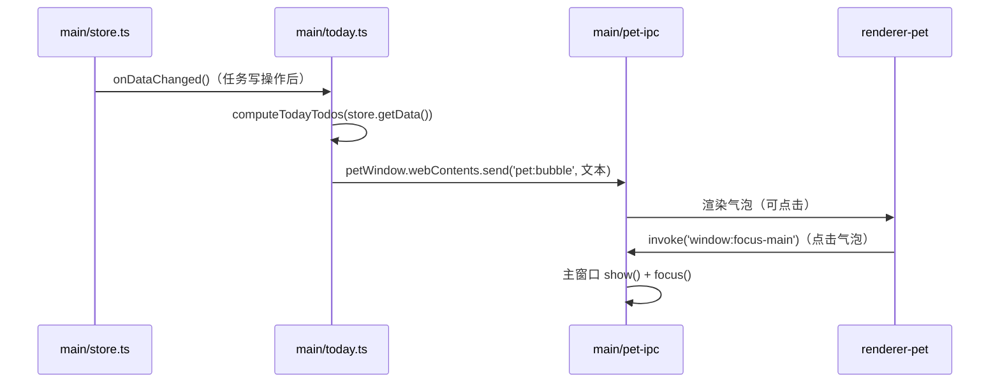
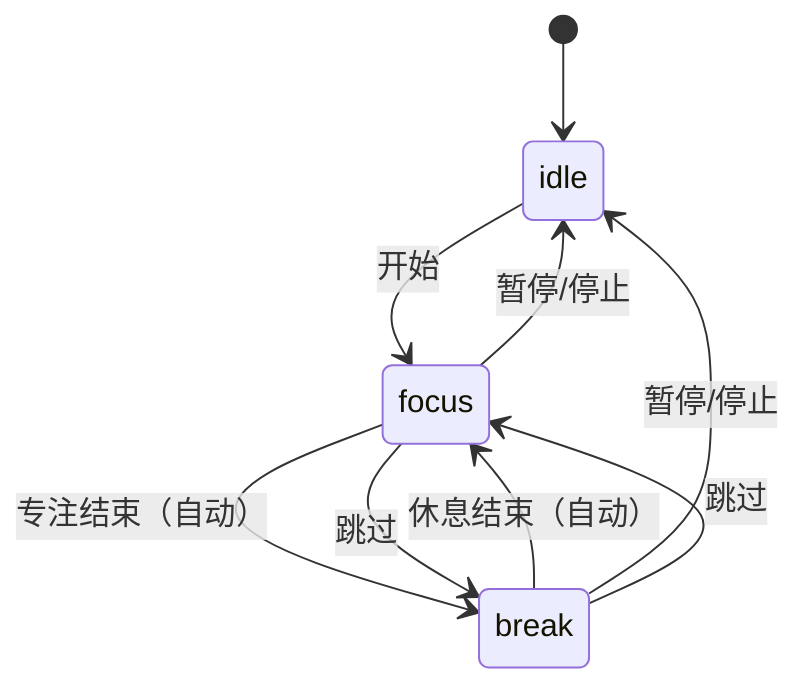
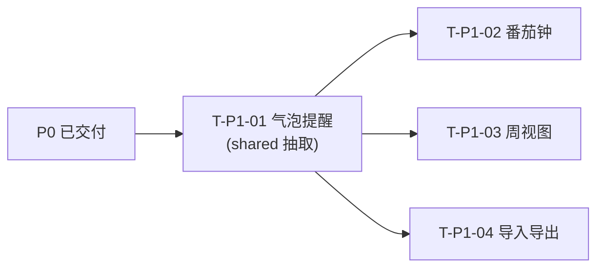

# Fantacy Todo List — P1 增量设计 + 增量任务列表

> 版本：v1.0
> 架构师：高见远
> 依据：`docs/02-Architecture.md`（P0 基线）+ 现有代码（`fantacy-todo-list/`，已逐文件核对现状）
> 范围：4 个 P1 功能（气泡提醒 / 番茄钟 / 周视图 / 数据备份导出导入）

---

## 0. 现状核对（已 Read 关键文件，与 02-Architecture 的差异说明）

动手前先对齐「设计文档 vs 实际代码」的几处差异，后续方案以**实际代码**为准：

| # | 差异点 | 实际现状 | 对本次 P1 的影响 |
| --- | --- | --- | --- |
| D1 | 桌宠模型 | 用 **Haru**（`haru_greeter_t03`），非 PRD 的「日和 Hiyori」；`pixi.js` 用 `^6.5.10`，`pixi-live2d-display/cubism4` 导入，Cubism Core 由 `pet/index.html` 的 `<script>` 注入（`env.d.ts` 声明 `Live2DCubismCore`） | 番茄钟「陪伴状态」可调用 Haru 的表情/动作组（模型含 F01–F08 表情与 idle/m05/m07/m14/m15 动作） |
| D2 | 重复引擎位置 | `repeatEngine.ts` + `date.ts` 目前在 `src/renderer/src/lib/`（**尚未**在 `src/shared/`） | 气泡提醒需把两者抽取到 `src/shared/`，主进程才能复用 |
| D3 | 主进程文件 | 实际为 `windows.ts` / `ipc.ts` / `pet-ipc.ts` / `tray.ts` / `store.ts`，比 02 文档更完整 | 直接基于这些文件做增量 |
| D4 | 单测 | 已有 `repeatEngine.test.ts` + `vitest`（`environment: node`，`include: src/**/*.test.ts`） | 抽取到 shared 后测试仍被 vitest 拾取 |
| D5 | tsconfig | `tsconfig.node.json` 已 `include` `src/shared/**/*`，`tsconfig.web.json` 也含 shared | shared 抽取无编译障碍 |

> 结论：四个功能都能在现有结构上做**最小增量**，无需改构建/目录骨架。

---

## 1. 功能一：桌宠气泡提醒今日待办（P1-01）

### 1.1 数据如何到桌宠窗口（最小改动方案）

当前问题：`repeatEngine` 在 renderer 端，桌宠窗口（独立渲染进程）拿不到「今日待办」——它既不持有任务数据，也不该持有。

**方案：把纯函数抽取到 shared，由主进程计算并 push，复用已有 `pet:bubble` 通道。**



### 1.2 新增/修改点

**① 抽取共享层（前置重构，最小改动）**

| 操作 | 文件 | 说明 |
| --- | --- | --- |
| 移动 | `src/renderer/src/lib/date.ts` → `src/shared/date.ts` | 纯函数，主/渲染两方共用（date-fns 为运行时依赖，主进程可用） |
| 移动 | `src/renderer/src/lib/repeatEngine.ts` → `src/shared/repeatEngine.ts` | 内部 `import './date'` 相对路径不变（同目录） |
| 移动 | `src/renderer/src/lib/repeatEngine.test.ts` → `src/shared/repeatEngine.test.ts` | vitest `include: src/**/*.test.ts` 仍覆盖 |
| 修改 import | `src/renderer/src/stores/uiStore.ts` | `../lib/date` → `../../../shared/date` |
| 修改 import | `src/renderer/src/hooks/useOccurrences.ts` | `../lib/date`→`../../../shared/date`；`../lib/repeatEngine`→`../../../shared/repeatEngine` |
| 修改 import | `src/renderer/src/components/calendar/DayCell.tsx` | `../../lib/date` → `../../../../shared/date` |
| 修改 import | `src/renderer/src/components/calendar/CalendarGrid.tsx` | `../../lib/date` → `../../../../shared/date` |
| 修改 import | `src/renderer/src/components/task/TaskEditorModal.tsx` | `../../lib/date` → `../../../../shared/date` |
| 删除 | 原 `src/renderer/src/lib/{date,repeatEngine,repeatEngine.test}.ts` | 移动后移除 |

> 相对路径规律（沿用现有约定）：深度 3 的文件（stores/hooks/services）用 `../../../shared/...`；深度 4 的组件用 `../../../../shared/...`。

**② 主进程计算今日待办**

- 新增 `src/main/today.ts`：
  - `computeTodayTodos(): TodayTodo[]`：读 `store.getData()`，遍历 `tasks`，对 `date != null` 且 `status === 'pending'` 的任务：有 `repeat` 用 `isOccurrenceOnDate(today, repeat, task.date)` + `getOccurrenceStatus(...)`（`done/skipped` 过滤）；无 `repeat` 用 `task.date === today`。按 `PRIORITY_ORDER` 排序。
  - `pushTodayBubble()`：组装文本 `今日 N 个待办\n• 标题1\n• 标题2…`（最多 3 条 + `…`），`getPetWindow()?.webContents.send(IPC_MAIN.petBubble, text)`（窗口不存在则静默跳过）。
- 新增类型 `TodayTodo { taskId, title, priority }`（放 `shared/types.ts`）。

**③ 触发时机（数据变更订阅）**

- 修改 `src/main/store.ts`：`setData()` 末尾触发一个轻量订阅（`onDataChanged(cb): () => void`），保持 store 仍是纯数据层、不感知桌宠。
- 修改 `src/main/index.ts`：`store.onDataChanged(() => pushTodayBubble())`（内部 300ms 防抖，避免批量写反复推）。
- 修改 `src/main/pet-ipc.ts` 或 `windows.ts`：桌宠窗口 `ready-to-show` 时补推一次（应用启动即提醒）；`pet:bubble` 现有 handler 保持不变。

**④ 气泡可点击唤回**

- 修改 `src/pet/src/bubble.tsx`：`<div>` 加 `onClick={() => window.petApi.focusMain()}`。
- 修改 `src/pet/src/index.css`：气泡加 `white-space: pre-line`（多行标题）+ `cursor: pointer`。
- **关键坑**：桌宠窗口默认 `setIgnoreMouse(true)` 穿透，气泡在 `.pet-hit-area` 之外，必须给气泡加 `onMouseEnter={() => window.petApi.setIgnoreMouse(false)}` / `onMouseLeave={() => window.petApi.setIgnoreMouse(true)}`，否则点击穿透到桌面、无法唤回。

### 1.3 验收要点
- 启动后、以及任意任务增删改/完成/单日覆盖后，桌宠气泡提示「今日待办数 + 标题」，数秒自动消失。
- 气泡悬停可交互、点击后主窗口 `show()+focus()`。
- 重复任务当日实例正确展开（命中 + 覆盖过滤）；收集箱项（`date=null`）不计入。
- `repeatEngine` 单测在 shared 抽取后仍全部通过。

---

## 2. 功能二：番茄专注计时陪伴（P1-02）

### 2.1 方案

纯 renderer 计时（zustand + setInterval），时长入配置；专注/休息阶段通过新增 IPC 通知桌宠切换「陪伴状态」。计时状态机如下：



### 2.2 新增/修改点

| 操作 | 文件 | 说明 |
| --- | --- | --- |
| 新增 | `src/renderer/src/stores/pomodoroStore.ts` | 状态机：`status(idle/running)`、`phase(focus/break)`、`remainingSeconds`、`focusMinutes`、`breakMinutes`；`start/pause/reset/skip`；`setInterval` 每秒递减；阶段切换时调 `api.notifyPomodoro(...)` |
| 新增 | `src/renderer/src/components/pomodoro/PomodoroTimer.tsx` | 圆形/进度条 + 剩余时间 + 开始/暂停/重置/跳过按钮 |
| 修改 | `src/shared/types.ts` | 新增 `PomodoroPhase = 'focus'\|'break'\|'idle'`、`PomodoroState { phase, remainingSeconds, totalSeconds }`；`AppConfig` 增加 `pomodoroFocusMinutes: number`、`pomodoroBreakMinutes: number`；`RendererApi` 增 `notifyPomodoro(state)`；`PetRendererApi` 增 `onPomodoro(cb)` |
| 修改 | `src/shared/defaults.ts` | `DEFAULT_CONFIG` 增 `pomodoroFocusMinutes: 25`、`pomodoroBreakMinutes: 5` |
| 修改 | `src/shared/ipc-channels.ts` | 增 `IPC.petNotifyPomodoro = 'pet:notify-pomodoro'`（R1→M）；`IPC_MAIN.petPomodoro = 'pet:pomodoro'`（M→R2） |
| 修改 | `src/main/pet-ipc.ts` | `ipcMain.handle(IPC.petNotifyPomodoro, (_e, state) => getPetWindow()?.webContents.send(IPC_MAIN.petPomodoro, state))` |
| 修改 | `src/preload/index.ts` | 暴露 `notifyPomodoro` |
| 修改 | `src/preload/pet.ts` | 暴露 `onPomodoro(cb): () => void`（订阅 `pet:pomodoro`） |
| 修改 | `src/renderer/src/services/ipc.ts` | 加 `notifyPomodoro(state)` 封装 |
| 修改 | `src/renderer/src/components/layout/TopBar.tsx` | 加「番茄」入口按钮（toggle `showPomodoro`） |
| 修改 | `src/renderer/src/stores/uiStore.ts` | 增 `showPomodoro: boolean` + `setShowPomodoro` |
| 修改 | `src/renderer/src/App.tsx` | 挂载 `<PomodoroTimer/>`（悬浮面板） |
| 修改 | `src/renderer/src/components/layout/SettingsPanel.tsx` | 增专注/休息时长两个数字输入（写 `configStore.update`） |
| 修改 | `src/pet/src/PetApp.tsx` | `useEffect` 订阅 `onPomodoro`，维护 `pomodoro` 本地状态 |
| 新增 | `src/pet/src/PomodoroBadge.tsx` | 陪伴徽标：`🍅 专注 24:10` / `☕ 休息 04:59`（**常驻不自动消失**，区别于气泡） |
| 修改 | `src/pet/src/index.css` | 徽标样式 |

### 2.3 「陪伴状态」落地（桌宠侧最小实现）

- 收到 `phase='focus'` → 显示「专注中」徽标 + 可选触发一次动作 `model.motion('Idle')`。
- `phase='break'` → 显示「休息中」徽标。
- `phase='idle'` → 隐藏徽标。
- 进阶（可选，不阻塞验收）：用 Haru 表情 `model.expression('F01')` 等做专注/休息差异化表情；本任务默认只做徽标 + 动作触发。

### 2.4 验收要点
- 默认 25/5 分钟，设置里可改并持久化（写 `config.json`）。
- 专注/休息自动切换；开始/暂停/重置/跳过可用；剩余时间准确递减。
- 每次阶段切换，桌宠徽标同步更新；桌宠隐藏时通知静默不报错。
- 计时不依赖主进程（关掉主窗口桌宠仍在/或按需），退出前无需额外落盘（时长已入 config）。

---

## 3. 功能三：周视图（P1-04 对应实现）

### 3.1 方案

复用 `useOccurrencesForDate(date)`：用「一周 7 个日期」驱动，每列一个日头 + 该日任务卡列表。月/周切换收敛在 `uiStore.view`。

### 3.2 新增/修改点

| 操作 | 文件 | 说明 |
| --- | --- | --- |
| 修改 | `src/shared/date.ts` | 增 `startOfWeekStr(date, weekStart): string` 与 `weekDates(anchorDate, weekStart): string[]`（返回连续 7 天） |
| 修改 | `src/renderer/src/stores/uiStore.ts` | 增 `view: 'month'\|'week'`（默认 `month`）、`setView`、`prevWeek`/`nextWeek`（把 `selectedDate` 前后平移 7 天） |
| 修改 | `src/renderer/src/components/layout/TopBar.tsx` | 增「月/周」切换（两个 tab）；周视图下翻页按钮改调 `prevWeek/nextWeek`，标签显示「M 月 d 日 – M 月 d 日」 |
| 新增 | `src/renderer/src/components/calendar/WeekView.tsx` | 7 列布局；每列用 `useOccurrencesForDate(d)` 取任务，渲染 `TaskCard`；列头显示星期 + 日期，今日高亮 |
| 修改 | `src/renderer/src/App.tsx` | `main` 区域按 `view` 渲染：`week ? <WeekView/> : <MonthCalendar/>`（`showInbox` 优先级不变） |
| 修改 | `src/renderer/src/index.css` | 周视图列/日头样式（尽量复用 `.day-cell` 视觉变量） |

### 3.3 验收要点
- 月/周切换即时生效；周视图 7 列按 `weekStart`（周一/周日）排列。
- 周视图展示单次任务 + 重复任务展开实例，优先级色条、勾选/右键等交互与月视图一致（复用 `TaskCard`）。
- 周视图前后翻周；「今天」回到含今天的周。

---

## 4. 功能四：数据备份 / 导出导入（P1-03 对应实现）

### 4.1 方案

主进程 `dialog.showSaveDialog / showOpenDialog` + `fs`，导出「data + config」为**单个备份文件**；导入时校验 schema，成功后重载快照回传 renderer。

备份文件格式（单文件，便于一键恢复）：

```json
{
  "app": "fantacy-todo-list",
  "backupVersion": 1,
  "exportedAt": "2025-08-15T08:00:00.000Z",
  "data": { "version": 1, "tasks": [], "overrides": [] },
  "config": { "petVisible": true, "...": "..." }
}
```

### 4.2 新增/修改点

| 操作 | 文件 | 说明 |
| --- | --- | --- |
| 新增 | `src/shared/validate.ts` | 纯函数 `validateBackupBundle(json: unknown): { ok: true, data: FullData, config: AppConfig } \| { ok: false, error: string }`；校验：`app` 标识、`backupVersion`、`data.version` 为数字、`data.tasks`/`data.overrides` 为数组、每项 `id/title/priority/status/date` 字段类型正确（缺字段/类型错即 `ok:false`） |
| 新增 | `src/shared/validate.test.ts` | 校验函数单测（合法/缺字段/类型错/非 JSON） |
| 新增 | `src/main/backup.ts` | `registerBackupIpc()`：`data:export` 走 `showSaveDialog`（默认名 `fantacy-backup-YYYYMMDD.json`）→ `atomicWrite`；`data:import` 走 `showOpenDialog` → `readFileSync` + `JSON.parse` + `validateBackupBundle` → 成功则 `store.setData(data)` + `store.setConfig(config)`（不防抖） |
| 修改 | `src/shared/types.ts` | 增 `BackupBundle`、`ExportResult { canceled, path?, error? }`、`ImportResult { canceled, data?, config?, error? }`；`RendererApi` 增 `exportData()`、`importData()` |
| 修改 | `src/shared/ipc-channels.ts` | 增 `IPC.dataExport = 'data:export'`、`IPC.dataImport = 'data:import'` |
| 修改 | `src/main/index.ts` | 注册 `registerBackupIpc()` |
| 修改 | `src/preload/index.ts` | 暴露 `exportData` / `importData` |
| 修改 | `src/renderer/src/services/ipc.ts` | 加 `exportData` / `importData` 封装 |
| 修改 | `src/renderer/src/components/layout/SettingsPanel.tsx` | 增「导出备份」「导入备份」按钮 + 结果/错误提示；导入成功后调用 `taskStore.load()` + `configStore.load()` 刷新快照 |

### 4.3 验收要点
- 导出：弹保存对话框，产出单个 `.json`，包含完整 data + config；取消不写文件。
- 导入：弹打开对话框，`validateBackupBundle` 校验通过后恢复 data+config，renderer 两 store 刷新；校验失败弹出错误、**不改动现有数据**（先校验后 `setData`）。
- 导入后原子写落盘，重启应用数据仍在。

---

## 5. 新增 / 变更 IPC 通道清单（汇总）

**渲染进程 → 主进程（invoke）新增**

| channel | 调用方 | 参数 | 返回 | 说明 |
| --- | --- | --- | --- | --- |
| `pet:notify-pomodoro` | R1 | `PomodoroState` | `void` | 番茄钟阶段同步（转发给桌宠） |
| `data:export` | R1 | — | `ExportResult` | 导出备份（含 dialog） |
| `data:import` | R1 | — | `ImportResult` | 导入备份（含校验 + dialog） |

**主进程 → 渲染进程（webContents.send）新增**

| channel | 接收方 | 载荷 | 说明 |
| --- | --- | --- | --- |
| `pet:pomodoro` | R2 | `PomodoroState` | 桌宠切换陪伴状态徽标 |

> 复用已有：`pet:bubble`（今日待办文本 push）、`window:focus-main`（气泡点击唤回）。

**新增共享类型**：`TodayTodo`、`PomodoroPhase`、`PomodoroState`、`BackupBundle`、`ExportResult`、`ImportResult`；`AppConfig` 增 `pomodoroFocusMinutes/pomodoroBreakMinutes`；`RendererApi`/`PetRendererApi` 增对应方法。

---

## 6. 有序增量任务列表

> 依赖策略：**T-P1-01 先做**（它是共享层重构，会改动 `useOccurrences`/`date` 的 import 路径，且 P2/P3/P4 都要改 `shared/types.ts`/`ipc-channels.ts`，先收口共享层可避免三者反复冲突）。T-P1-02/03/04 在 T-P1-01 之后可并行开发。

### T-P1-01 气泡提醒（含 shared 层抽取）
- **依赖**：P0 已交付（无 P1 依赖）
- **涉及文件**
  - 移动：`src/shared/date.ts`、`src/shared/repeatEngine.ts`、`src/shared/repeatEngine.test.ts`（源自 `src/renderer/src/lib/`）
  - 新增：`src/main/today.ts`
  - 修改：`src/renderer/src/stores/uiStore.ts`、`hooks/useOccurrences.ts`、`components/calendar/DayCell.tsx`、`components/calendar/CalendarGrid.tsx`、`components/task/TaskEditorModal.tsx`（改 import 路径）；`src/main/store.ts`（onDataChanged 订阅）、`src/main/index.ts`（订阅 + pet ready 推送）、`src/main/pet-ipc.ts`（ready 补推）、`src/pet/src/bubble.tsx`（可点击）、`src/pet/src/index.css`（pre-line + pointer + 穿透开关）
  - 删除：`src/renderer/src/lib/{date,repeatEngine,repeatEngine.test}.ts`
- **验收**：见 §1.3

### T-P1-02 番茄专注计时陪伴
- **依赖**：T-P1-01（shared 层已收口，避免 types/ipc-channels 冲突）
- **涉及文件**
  - 新增：`src/renderer/src/stores/pomodoroStore.ts`、`src/renderer/src/components/pomodoro/PomodoroTimer.tsx`、`src/pet/src/PomodoroBadge.tsx`
  - 修改：`src/shared/types.ts`、`src/shared/defaults.ts`、`src/shared/ipc-channels.ts`、`src/main/pet-ipc.ts`、`src/preload/index.ts`、`src/preload/pet.ts`、`src/renderer/src/services/ipc.ts`、`components/layout/TopBar.tsx`、`components/layout/SettingsPanel.tsx`、`stores/uiStore.ts`、`App.tsx`、`src/pet/src/PetApp.tsx`、`src/pet/src/index.css`
- **验收**：见 §2.4

### T-P1-03 周视图
- **依赖**：T-P1-01（复用 `shared/date` 新增 weekDates）
- **涉及文件**
  - 新增：`src/renderer/src/components/calendar/WeekView.tsx`
  - 修改：`src/shared/date.ts`、`src/renderer/src/stores/uiStore.ts`、`components/layout/TopBar.tsx`、`App.tsx`、`src/renderer/src/index.css`
- **验收**：见 §3.3

### T-P1-04 数据备份 / 导出导入
- **依赖**：T-P1-01（新增 shared/validate 与 ipc-channels 变更需 shared 稳定）
- **涉及文件**
  - 新增：`src/shared/validate.ts`、`src/shared/validate.test.ts`、`src/main/backup.ts`
  - 修改：`src/shared/types.ts`、`src/shared/ipc-channels.ts`、`src/main/index.ts`、`src/preload/index.ts`、`src/renderer/src/services/ipc.ts`、`components/layout/SettingsPanel.tsx`
- **验收**：见 §4.3



---

## 7. 共享知识补充（P1 增量）

- **shared 层引用关系（抽取后）**：
  - `src/shared/date.ts` ← `repeatEngine.ts`、`today.ts`(main)、`useOccurrences.ts`、`uiStore.ts`、`DayCell.tsx`、`CalendarGrid.tsx`、`TaskEditorModal.tsx`、`WeekView.tsx`
  - `src/shared/repeatEngine.ts` ← `today.ts`(main)、`useOccurrences.ts`
  - `src/shared/validate.ts` ← `backup.ts`(main)、`validate.test.ts`
  - 约定：`shared/` 只放**纯类型 + 纯函数 + 常量**，禁止引入 electron/DOM/react 依赖（date-fns 除外，其为运行时依赖、主/渲染通用）。
- **IPC 命名延续**：invoke 用动宾（`pet:notify-pomodoro`、`data:export`、`data:import`）；`webContents.send` 用事件名（`pet:pomodoro`、`pet:bubble`）。
- **桌宠窗口交互红线**：任何需点击的桌宠 UI（气泡/徽标）都必须自管理 `setIgnoreMouse` 的 enter/leave，否则默认穿透无法交互。
- **计时器清理**：pomodoro 的 `setInterval` 必须在 store 内持有 id，`pause/reset` 与组件卸载时 `clearInterval`，避免泄漏。
- **导入安全**：导入先 `validateBackupBundle` 校验、**再** `store.setData/setConfig`；校验失败绝不触碰现有数据。
- **config 高频写**：番茄钟时长走 `configStore.update`（复用 200ms 防抖），阶段切换**不写 config**、只走 `pet:notify-pomodoro` 通知。

---

## 8. 待明确事项（本次增量）

| # | 问题 | 默认建议 |
| --- | --- | --- |
| B1 | 气泡提醒的触发频率 | 默认「数据变更 + 启动/桌宠 ready」时推一次；若需周期提醒（如每 30 分钟）需 PM 确认，避免打扰 |
| B2 | 番茄钟「陪伴状态」是否要求 Live2D 表情差异 | 默认只做徽标 + 阶段切换动作；表情（Haru F01–F08）差异化列为后续增强 |
| B3 | 番茄钟完成后是否联动「完成任务/撒花」 | 默认不联动（专注计时独立于待办），避免产品语义耦合 |
| B4 | 导入是否允许「覆盖当前数据」还是「合并」 | 默认**覆盖**（data + config 全量恢复），符合「备份恢复」语义 |
| B5 | 周视图锚点 | 默认锚定 `selectedDate`（今天），翻周平移 7 天；不额外引入独立周锚点状态 |
| B6 | 备份文件名/是否加密 | 默认明文 `fantacy-backup-YYYYMMDD.json`，不加密（本地工具，无敏感账号） |
