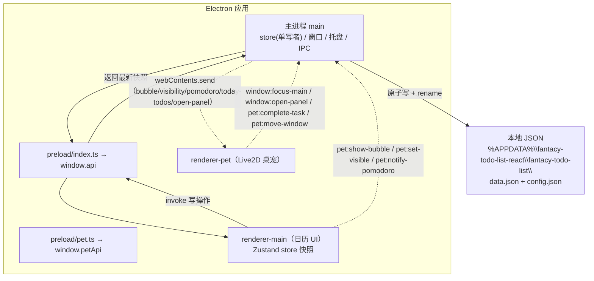

# Fantacy Todo List — Code Wiki

> 版本：v1.3.0 基线
> 用途：面向开发者 / 维护者的代码导航手册，描述项目整体架构、模块职责、关键类与函数、依赖关系与运行方式。
> 关联文档：[01-PRD.md](./01-PRD.md)（需求）｜[02-Architecture.md](./02-Architecture.md)（架构设计）｜[03-增量设计-P1.md](./03-增量设计-P1.md)（P1 增量）

---

## 1. 项目概览（TL;DR）

一款 **Windows 桌面「日历待办清单 + Live2D 桌宠陪伴」** 应用。

- **定位**：本地优先。无账号、无云端、无广告、无遥测，数据 100% 存本机 JSON。
- **形态**：Electron 桌面应用，运行时包含两个窗口——日历主窗口 + 常驻桌面的 Live2D 桌宠窗口。
- **核心功能**：
  - 月历 / 周 / 日三种视图，今日高亮，优先级三档颜色（高红 / 中琥珀 / 低灰）
  - 重复任务（每天 / 每周 / 每月 / 每年 / 自定义 N 天，支持结束日期与次数），单日独立完成 / 跳过
  - 任务拖拽改期、收集箱拖拽排序、完成撒花动画、放弃状态
  - 番茄专注计时（桌宠陪伴徽标）、习惯打卡、倒数日、统计看板、数据备份导入导出
  - Live2D 桌宠（6 个官方角色可切换）、今日待办气泡提醒、悬浮待办浮层
- **技术栈**：Electron 31 · React 18 · Vite · TypeScript 5 · Tailwind CSS · Zustand · @dnd-kit · canvas-confetti · date-fns · PIXI.js v6 · pixi-live2d-display
- **质量现状**：typecheck 0 错误；vitest 单测（shared 纯函数层）全绿；`npm run build:win` 可产出 NSIS 安装包。

---

## 2. 目录结构

```
fantacy-todo-list/
├── package.json                 # 脚本 / 依赖清单
├── electron.vite.config.ts      # 三端构建配置（main / preload / renderer 双入口）
├── electron-builder.yml         # 打包配置（nsis，卸载保留数据）
├── vitest.config.ts             # 单测配置（node 环境，src/**/*.test.ts）
├── tsconfig.json / .node / .web # TypeScript 工程引用
├── tailwind.config.js           # darkMode: 'media'，随系统深浅色
├── postcss.config.js
├── .npmrc                       # 国内镜像加速
├── resources/                   # 应用图标（icon.ico / icon.png）
├── scripts/gen-icon.mjs         # 图标生成脚本
├── docs/                        # PRD / 架构 / P1 增量 / 本 Wiki
└── src/
    ├── shared/                  # ★ 四方共享层（纯类型 + 纯函数，无 IO）
    │   ├── types.ts             # 全部实体类型唯一来源
    │   ├── ipc-channels.ts      # IPC channel 常量唯一来源
    │   ├── defaults.ts          # 默认配置 / 默认数据 / 枚举映射
    │   ├── date.ts              # YYYY-MM-DD 本地时区解析/格式化
    │   ├── repeatEngine.ts      # 重复任务引擎（纯函数）
    │   ├── conflict.ts          # 时间冲突检测（纯函数）
    │   ├── countdown.ts         # 倒数日计算（纯函数）
    │   ├── habit.ts             # 习惯打卡 / 连续天数（纯函数）
    │   ├── stats.ts             # 统计看板计算（纯函数）
    │   ├── time.ts              # 时间格式化工具（纯函数）
    │   ├── validate.ts          # 备份文件校验（纯函数）
    │   └── *.test.ts            # 以上各模块的单测
    ├── main/                    # ★ Electron 主进程（数据权威源）
    │   ├── index.ts             # 入口：生命周期 / 单实例锁 / 初始化 / IPC 注册
    │   ├── windows.ts           # 主窗口 + 桌宠窗口工厂
    │   ├── store.ts             # JSON 读写 + 原子写 + 防抖 + 变更订阅
    │   ├── ipc.ts               # 数据类 IPC handler（task/override/config/goal/habit）
    │   ├── pet-ipc.ts           # 桌宠/窗口类 IPC handler
    │   ├── backup.ts            # 导出 / 导入（dialog + 校验 + 覆盖）
    │   ├── today.ts             # 今日待办计算 + 气泡/浮层推送
    │   └── tray.ts              # 系统托盘
    ├── preload/                 # ★ 预加载脚本（contextBridge 白名单）
    │   ├── index.ts             # → window.api（主窗口）
    │   └── pet.ts               # → window.petApi（桌宠窗口）
    ├── renderer/                # ★ 主窗口渲染进程（React 日历待办 UI）
    │   ├── index.html
    │   └── src/
    │       ├── main.tsx / App.tsx / env.d.ts / index.css
    │       ├── services/ipc.ts  # window.api 强类型二次封装
    │       ├── stores/          # task / config / ui / pomodoro / goal / habit
    │       ├── hooks/           # useOccurrences / useDragDate / useConflicts
    │       ├── lib/             # confetti.ts（撒花） / id.ts（UUID）
    │       └── components/
    │           ├── layout/      # TopBar / Sidebar / SettingsPanel
    │           ├── calendar/    # MonthCalendar / CalendarGrid / DayCell / TaskCard / WeekView / DayView
    │           ├── task/        # TaskEditorModal / RepeatRuleEditor / TaskContextMenu / Stopwatch
    │           ├── inbox/       # InboxList
    │           ├── pomodoro/    # PomodoroTimer
    │           ├── stats/       # StatsPanel
    │           ├── habit/       # HabitPanel
    │           └── goals/       # CountdownPanel
    └── pet/                     # ★ 桌宠窗口渲染进程（Live2D）
        ├── index.html
        ├── public/live2d/       # Cubism Core + 6 个官方模型（本地打包，离线）
        └── src/
            ├── main.tsx / PetApp.tsx / Live2DStage.tsx
            ├── pet-events.ts    # 缩放钳制 / 拖拽阈值 / 命中区 / 动作组选择
            ├── bubble.tsx       # 气泡提醒
            ├── TodayOverlay.tsx # 今日待办悬浮浮层
            ├── PomodoroBadge.tsx# 番茄陪伴徽标
            └── confetti.ts      # 桌宠撒花
```

---

## 3. 整体架构

### 3.1 进程模型

应用由 **1 个主进程 + 2 个预加载 + 2 个渲染进程** 组成：

| 进程 | 角色 | 代码位置 | 职责 |
| --- | --- | --- | --- |
| **main** | 主进程 | `src/main/` | 窗口 / 托盘管理、数据存储（唯一写者）、IPC 路由、今日待办计算、备份导入导出 |
| **preload/index** | 主窗口预加载 | `src/preload/index.ts` | 经 `contextBridge` 暴露 `window.api`（白名单方法） |
| **preload/pet** | 桌宠预加载 | `src/preload/pet.ts` | 暴露 `window.petApi` |
| **renderer-main** | 日历主窗口 | `src/renderer/` | React 日历待办 UI（月/周/日视图、收集箱、统计、设置等） |
| **renderer-pet** | 桌宠窗口 | `src/pet/` | PIXI WebGL + Live2D 渲染、气泡 / 浮层 / 番茄徽标 |

### 3.2 通信与数据流（核心设计）

**数据权威源在主进程 `store.ts`，一切写操作单向收敛到主进程**，渲染进程只做「快照 + 本地派生」，绝不直接写文件。



关键设计决策：

1. **单写者 + 原子写**：所有写操作经 IPC 收敛到 `main/store.ts`；写入用「临时文件 + `renameSync`」保证崩溃不损坏文件；config 高频写（桌宠拖拽/缩放）走 200ms 防抖。
2. **类型与常量唯一来源**：实体类型只在 `src/shared/types.ts`，IPC channel 只在 `src/shared/ipc-channels.ts`，四方统一 import，禁止散落字面量。
3. **数据/配置拆分**：`data.json`（任务业务数据，低频写）与 `config.json`（应用配置，高频写）分离，避免桌宠高频配置写反复重写整个任务表。
4. **桌宠不解耦业务数据**：桌宠只读 `config` 中自己的 position/scale/visible；今日待办由主进程计算后 `send` 推送。
5. **双渲染入口**：`renderer/index.html`（main）+ `renderer/pet.html`（pet），由 electron-vite 统一编排。

### 3.3 安全红线

- 两窗口均 `contextIsolation: true`、`nodeIntegration: false`、`sandbox: false`。
- preload 只暴露白名单方法，不泄露 `ipcRenderer` 原始对象。
- 桌宠窗口 `transparent + frame:false + alwaysOnTop('screen-saver') + skipTaskbar + hasShadow:false`；因 Live2D 资源在 `file://` 下经 XHR 加载受 CORS 拦截，`webSecurity: false`（资源全本地、无网络请求）。

---

## 4. 主要模块职责

### 4.1 `src/shared/` — 跨进程共享层（纯函数 + 类型）

四方共用的纯类型 / 常量 / 纯逻辑，无 IO、无 React 依赖，可独立单测。

| 文件 | 职责 |
| --- | --- |
| `types.ts` | 全部实体类型：`Task`、`RepeatRule`、`RepeatOverride`、`CountdownGoal`、`Habit`、`AppConfig`、`FullData`、`Occurrence`、`TodayTodo`、`PomodoroState`、`BackupBundle`、`RendererApi`、`PetRendererApi` 等 |
| `ipc-channels.ts` | IPC channel 常量 `IPC`（R→M invoke）与 `IPC_MAIN`（M→R send） |
| `defaults.ts` | `DEFAULT_CONFIG`、`DEFAULT_DATA`、`DATA_VERSION`、优先级/分类/颜色枚举映射、`taskColor()`、桌宠模型清单 `PET_MODELS` |
| `date.ts` | 本地时区 `YYYY-MM-DD` 解析/格式化（禁止 `new Date('YYYY-MM-DD')`，避免 UTC 偏移） |
| `repeatEngine.ts` | 重复任务引擎：命中判断、区间展开、覆盖状态、第 N 次发生 |
| `conflict.ts` | 时间冲突检测（同日 + 半开区间重叠） |
| `countdown.ts` | 倒数日剩余天数 |
| `habit.ts` | 习惯打卡判断与连续天数 |
| `stats.ts` | 统计看板全部指标计算 |
| `time.ts` | `HH:mm` 解析、`hh:mm:ss` / 用时格式化 |
| `validate.ts` | 备份 bundle 结构校验（先校验后覆盖） |

### 4.2 `src/main/` — Electron 主进程

| 文件 | 职责 |
| --- | --- |
| `index.ts` | 入口。单实例锁（`requestSingleInstanceLock`）→ `app.whenReady` → `store.init()` → 注册三组 IPC → 创建主/桌宠窗口 + 托盘 → 订阅数据变更推气泡/浮层 |
| `windows.ts` | `createMainWindow`（1280×820，日历主窗口）/ `createPetWindow`（320×420 透明置顶）；`showPetWindow/hidePetWindow/setPetVisible/getMainWindow/getPetWindow/setQuitting` |
| `store.ts` | `Store` 类：内存快照、`atomicWrite`、`setData/setConfig/getData/getConfig`、config 防抖写、`onDataChanged` 订阅、旧数据 `normalizeData` 迁移（补全 category/color/goals/habits） |
| `ipc.ts` | 数据类 handler：task CRUD / move / setStatus / reorderInbox、override set/clear、config get/set、goal/habit create/delete/toggle |
| `pet-ipc.ts` | 桌宠/窗口 handler：气泡转发、显隐、移窗、鼠标穿透、番茄状态转发、聚焦主窗口、打开面板、桌宠完成待办、最小化/退出 |
| `backup.ts` | 导出（saveDialog + 原子写）、导入（openDialog + `validateBackupBundle` 先校验后覆盖） |
| `today.ts` | `computeTodayTodos`（含重复展开 + done/skipped 过滤）、`pushTodayBubble`（气泡文本）、`pushTodayTodos`（结构化浮层数据） |
| `tray.ts` | 系统托盘：显示主窗口 / 显隐桌宠 / 退出 |

### 4.3 `src/preload/` — 预加载脚本

| 文件 | 暴露 | 说明 |
| --- | --- | --- |
| `index.ts` | `window.api`（`RendererApi`） | 全部数据/配置/窗口 invoke 的强类型封装 + `onOpenPanel` 订阅 |
| `pet.ts` | `window.petApi`（`PetRendererApi`） | 桌宠专用：get/setConfig、moveWindow、setIgnoreMouse、focusMain、openPanel、completeTask、quit + `onBubble/onVisibility/onPomodoro/onTodayTodos` 订阅 |

### 4.4 `src/renderer/` — 主窗口（日历待办 UI）

- **stores**（Zustand，均为 main 数据快照的单向映射）：
  - `taskStore`：`tasks + overrides` + 全部任务操作（经 `services/ipc`）
  - `configStore`：`AppConfig` 快照 + `update`
  - `uiStore`：当前年月、选中日期、视图（month/week/day）、编辑弹窗状态、筛选、各面板开关、拖拽落点、右键菜单、正向计时器
  - `pomodoroStore`：番茄钟状态机（setInterval 每秒递减，阶段切换通知桌宠）
  - `goalStore` / `habitStore`：倒数日 / 习惯数据
- **hooks**：
  - `useOccurrences`：单日 / 整月任务实例计算（重复展开 + 覆盖过滤 + 排序）
  - `useDragDate`：日历拖拽改期（落点高亮 + onDragEnd 改期 / 实例搬迁）
  - `useConflicts`：单日时间冲突 id 集合
- **components**：
  - `layout/`：`TopBar`（视图切换/翻页/今天/番茄/设置/窗口控制）、`Sidebar`（收集箱/统计/习惯/倒数日/筛选）、`SettingsPanel`（撒花/周起始/桌宠/番茄时长/备注/备份）
  - `calendar/`：`MonthCalendar`（表头）、`CalendarGrid`（7 列网格 + DndContext）、`DayCell`（单日格）、`TaskCard`（任务卡）、`WeekView`、`DayView`
  - `task/`：`TaskEditorModal`（新建/编辑，含时间冲突提示）、`RepeatRuleEditor`、`TaskContextMenu`（右键：重复任务=单日动作，非重复=放弃/删除）、`Stopwatch`
  - `inbox/`、`pomodoro/`、`stats/`、`habit/`、`goals/`
- **services/ipc.ts**：`window.api` 强类型二次封装（store 唯一入口）
- **lib/**：`confetti.ts`（撒花）、`id.ts`（UUID）

### 4.5 `src/pet/` — 桌宠窗口（Live2D）

| 文件 | 职责 |
| --- | --- |
| `PetApp.tsx` | 根组件：鼠标穿透统一开关、拖拽移窗、滚轮缩放、右键菜单（切换角色/隐藏/跳转面板/退出）、气泡与番茄徽标、完成待办庆祝（随机动作 + 撒花 + 文案） |
| `Live2DStage.tsx` | PIXI.Application（透明）加载 `model3.json`；**关键**：手动 `Live2DModel.registerTicker(PIXI.Ticker)` 否则模型停 T-pose；切换角色销毁旧模型；`live2dConfig.sound=false` 静音 |
| `pet-events.ts` | 缩放钳制（0.3–1.5）、拖拽阈值、`computePetHitBox`（按模型宽高/scale 算命中热区）、`pickTapMotionGroup`（动态读真实动作组） |
| `bubble.tsx` | 气泡提醒（点击唤回主窗口，悬停捕获鼠标） |
| `TodayOverlay.tsx` | 今日待办悬浮浮层（标题 + 优先级色点 + 打勾完成） |
| `PomodoroBadge.tsx` | 番茄专注/休息徽标（常驻） |
| `confetti.ts` | 完成待办撒花 |

---

## 5. 关键数据模型（`src/shared/types.ts`）

```typescript
type Priority = 'high' | 'medium' | 'low'
type TaskStatus = 'pending' | 'done' | 'abandoned'
type RepeatType = 'daily' | 'weekly' | 'monthly' | 'yearly' | 'custom'
type OverrideAction = 'done' | 'skipped'
type PetModelId = 'haru' | 'hiyori' | 'natori' | 'mao' | 'wanko' | 'rice'
type PomodoroPhase = 'focus' | 'break' | 'idle'

interface RepeatRule {
  type: RepeatType
  interval: number          // 间隔数；custom = 每隔 N 天
  weekdays?: number[]       // weekly：0=周日…6=周六
  monthDay?: number         // monthly：1–31
  yearMonth?: number        // yearly：1–12
  yearDay?: number          // yearly：1–31
  endDate?: string | null   // YYYY-MM-DD，null=无限
  endCount?: number | null  // 次数上限，null=无限
}

interface Task {
  id: string
  title: string
  description?: string
  priority: Priority
  date: string | null       // YYYY-MM-DD；null = 收集箱
  status: TaskStatus
  createdAt: string         // ISO 8601
  updatedAt: string
  completedAt?: string | null
  repeat?: RepeatRule | null
  inboxOrder?: number | null // 收集箱排序
  tags: string[]
  category?: string          // 自定义分类
  color?: string             // 自定义颜色（hex），缺省回退优先级色
  startTime?: string         // HH:mm，与 endTime 成对
  endTime?: string           // HH:mm，需 > startTime
  durationSec?: number       // 正向计时完成用时（秒）
}

interface RepeatOverride { id: string; taskId: string; occurrenceDate: string; action: OverrideAction }
interface CountdownGoal { id: string; title: string; targetDate: string; createdAt: string }
interface Habit { id: string; title: string; checkins: string[] }  // checkins = YYYY-MM-DD[]

interface AppConfig {
  petVisible: boolean
  petPosition: { x: number; y: number }
  petScale: number
  selectedModel: PetModelId
  confettiEnabled: boolean
  weekStart: number            // 0=周日 1=周一
  theme: string
  pomodoroFocusMinutes: number // 默认 25
  pomodoroBreakMinutes: number // 默认 5
  showNotesInCalendar: boolean
  noteTruncateLength: number
}

interface FullData { version: number; tasks: Task[]; overrides: RepeatOverride[]; goals: CountdownGoal[]; habits: Habit[] }
interface Occurrence { task: Task; date: string; status: TaskStatus | 'skipped' }
interface TodayTodo { taskId: string; title: string; priority: Priority }
interface PomodoroState { phase: PomodoroPhase; remainingSeconds: number; totalSeconds: number }
interface BackupBundle { app: string; backupVersion: number; exportedAt: string; data: FullData; config: AppConfig }
```

---

## 6. 关键类与函数说明

### 6.1 `src/main/store.ts` — 数据存储层

| 成员 | 说明 |
| --- | --- |
| `constructor()` | 数据路径 `%APPDATA%\fantacy-todo-list-react\fantacy-todo-list`，初始化内存快照 |
| `init()` | 建目录、读 `data.json`/`config.json`（缺失写默认值）、`normalizeData` 迁移旧数据、回填 `selectedModel` |
| `getData()` / `getConfig()` | 返回深拷贝快照（避免外部篡改） |
| `setData(data)` | 写 data.json（原子）+ 通知 `onDataChanged` 订阅者（气泡/浮层推送方） |
| `setConfig(patch, {debounce})` | 合并写 config；桌宠高频写走 200ms 防抖 |
| `flushConfig()` | 退出前把防抖中的 config 落盘（`before-quit` 调用） |
| `onDataChanged(cb)` | 数据变更订阅，返回取消订阅函数 |
| `atomicWrite(filePath, content)` | 先写 `.tmp` 再 `renameSync`，同卷原子覆盖 |
| `normalizeData(data)` | 为旧任务补 `category/color`，补 `goals/habits` 数组 |

### 6.2 `src/main/ipc.ts` — 数据类 IPC handler

所有 handler 模式一致：`getData → 修改 → store.setData → 返回最新对象`。

| handler | 说明 |
| --- | --- |
| `data:load` | 返回 `FullData` |
| `task:create` | 新建任务；`date=null` 时分配 `nextInboxOrder`（收集箱） |
| `task:update` | 按 id 合并 patch，强制保留 id、刷新 `updatedAt` |
| `task:delete` | 删任务并清理其全部 overrides |
| `task:move` | 拖拽改期：改 `date`（重复任务=anchor 平移），并**清空该任务所有 overrides**（避免孤儿覆盖） |
| `task:setStatus` | 完成/放弃；`done` 时写 `completedAt` |
| `task:reorderInbox` | 按 `orderedIds` 批量写收集箱 `inboxOrder` |
| `override:set` | 重复任务单日完成/跳过（存在则更新，否则新建） |
| `override:clear` | 撤销单日覆盖 |
| `goal:create/delete`、`habit:create/delete/toggle` | 倒数日 / 习惯 CRUD |
| `config:get` / `config:set` | 配置读写（写带防抖） |

### 6.3 `src/shared/repeatEngine.ts` — 重复任务引擎（纯函数）

| 函数 | 说明 |
| --- | --- |
| `isOccurrenceOnDate(date, rule, anchorDate)` | 某日是否命中（含不向前回溯、endDate、endCount 边界） |
| `matchesPattern(date, rule, anchor)` | 纯模式匹配（daily/weekly/monthly/yearly/custom），短月钳制、2/29 非闰年钳制 |
| `nthOccurrence(rule, anchorDate, n)` | 第 N 次（1-based）发生日期；基于枚举，`MAX_ITER=200000` |
| `getOccurrenceStatus(taskId, date, overrides, baseStatus)` | 实例最终状态（override 优先：done/skipped） |
| `listOccurrencesInRange(rule, anchorDate, from, to, overrides, baseStatus, taskId?)` | 展开区间内所有实例（`MAX_DAYS=400`） |

### 6.4 `src/shared/` 其它纯函数

| 模块 | 函数 | 说明 |
| --- | --- | --- |
| `date.ts` | `parseLocal / formatLocal / todayStr / addDays / startOfMonthStr / endOfMonthStr / daysInMonth / leadingBlanks / currentYearMonth / shiftMonth / startOfWeekStr / weekDates` | 本地时区日期工具 |
| `conflict.ts` | `hasTimeRange / hasOverlap / detectConflicts / conflictsForTask` | 同日 `[start,end)` 半开区间重叠检测 |
| `countdown.ts` | `daysUntil(targetDate, today)` | 正=未来，0=当天，负=已过 |
| `habit.ts` | `isCheckedOn / streakOf` | 连续打卡（当天未打不立即断签） |
| `stats.ts` | `computeStats(tasks, overrides, options)` | 今日/本周/累计完成率、连续打卡、任务计数、优先级/分类分布 |
| `time.ts` | `timeToMinutes / formatHms / formatDurationMinutes` | 时间解析与格式化 |
| `validate.ts` | `validateBackupBundle(json)` | bundle schema 校验，通过才允许覆盖 |
| `defaults.ts` | `taskColor(task)` | 有自定义色用之，否则回退优先级 CSS 变量 |

### 6.5 `src/main/today.ts` — 今日待办

- `computeTodayTodos()`：遍历 tasks，过滤收集箱项与已完成项；重复任务用 `isOccurrenceOnDate + getOccurrenceStatus`（done/skipped 过滤），非重复用 `task.date === today`；按优先级排序。
- `pushTodayBubble()`：无窗口或今日无待办则静默；组装「今日 N 个待办 + 最多 3 条标题」经 `pet:bubble` 发送。
- `pushTodayTodos()`：发送结构化 `TodayTodo[]`（悬浮浮层数据源）。

### 6.6 主窗口 hooks（`src/renderer/src/hooks/`）

| hook | 说明 |
| --- | --- |
| `useOccurrencesForDate(date, sort)` | 单日实例（重复展开 + 过滤 skipped + 排序 priority/time） |
| `useOccurrencesForMonth(year, month)` | 整月按日期分组的实例映射（用 `listOccurrencesInRange`） |
| `useDragDate()` | `onDragOver`（落点高亮）+ `onDragEnd`（改期；重复非 anchor 实例=跳过原实例 + 目标日新建副本） |
| `useConflictsForDate(date)` | 单日冲突任务 id 集合 |

### 6.7 桌宠模块（`src/pet/src/`）

| 模块 | 关键点 |
| --- | --- |
| `Live2DStage.tsx` | PIXI.Application 只建一次（复用 WebGL 上下文）；按 `modelId` 切换销毁重建；**必须 `Live2DModel.registerTicker(PIXI.Ticker)`** 否则模型静止；`live2dConfig.sound=false` 静音 |
| `PetApp.tsx` | 鼠标穿透集中开关 `setPetInteractive`；窗口级 mousemove/mouseup 实现拖拽移窗；滚轮缩放（0.3–1.5 钳制）；右键菜单（6 角色切换 + 面板跳转 + 退出）；`celebrate()` 完成庆祝 |
| `pet-events.ts` | `computePetHitBox(model)` 按实际宽高/scale 收缩 12%/18% 算热区；`pickTapMotionGroup(model)` 动态读取真实动作组（优先非 idle，如 `TapBody`） |
| `TodayOverlay.tsx` | 悬浮浮层，打勾经 `petApi.completeTask` 完成（重复任务走 override），独立鼠标捕获 |

### 6.8 核心 UI 组件

| 组件 | 说明 |
| --- | --- |
| `App.tsx` | 顶层布局 + 各 store 初始化 load + `onOpenPanel` 订阅（桌宠快捷跳面板） |
| `TaskCard.tsx` | 任务卡：优先级色条 / 勾选（重复走 override）/ 拖拽 / 右键 / 时间 / 备注截断 / 正向计时 |
| `TaskEditorModal.tsx` | 新建/编辑：时间冲突提示、分类/颜色、起止时间校验、重复规则 |
| `TaskContextMenu.tsx` | 重复任务仅单日动作（完成/跳过这一天）；非重复可放弃/删除 |
| `CalendarGrid.tsx` | 前置/后置空白计算 + DndContext（`activationConstraint: {distance:6}` 防误触） |
| `InboxList.tsx` | SortableContext 垂直排序 + 安排到日历 |
| `StatsPanel.tsx` | `computeStats` 渲染：完成率进度条 / 连续打卡 / 优先级与分类分布 |
| `PomodoroTimer.tsx` / `pomodoroStore.ts` | 番茄钟状态机 + 桌面端 UI；阶段切换通知桌宠 |

---

## 7. 依赖关系

### 7.1 第三方包依赖（`package.json`）

**dependencies（运行时）**

| 包 | 版本 | 用途 |
| --- | --- | --- |
| `react` / `react-dom` | ^18.3.1 | UI |
| `zustand` | ^4.5.4 | 状态管理 |
| `date-fns` | ^3.6.0 | 日期处理 |
| `@dnd-kit/core` / `sortable` / `utilities` | ^6.1.0 / ^8.0.0 / ^3.2.2 | 拖拽（日历改期 + 收集箱排序） |
| `canvas-confetti` | ^1.9.3 | 完成撒花 |
| `pixi.js` | ^6.5.10 | WebGL 渲染（**必须 v6**，兼容 `pixi-live2d-display@0.4.0` 的 `@pixi/* ^6` peer 依赖；v7/v8 不兼容） |
| `pixi-live2d-display` | ^0.4.0 | Live2D 渲染（`/cubism4` 入口） |

**devDependencies（构建 / 工具）**

| 包 | 用途 |
| --- | --- |
| `electron` ^31 / `electron-vite` ^2.3 / `electron-builder` ^24 | 桌面框架 / 构建编排 / 打包 |
| `vite` ^5 / `@vitejs/plugin-react` / `typescript` ^5.5 | 构建与类型 |
| `tailwindcss` ^3.4 / `postcss` / `autoprefixer` | 样式 |
| `vitest` ^2 | 单测 |

> **Live2D 资源说明**：Cubism Core（`live2dcubismcore.min.js`）与 6 个官方示例模型（Haru/Hiyori/Natori/Mao/Wanko/Ren）因授权不能经 npm 分发，已本地打包在 `src/pet/public/live2d/`，运行时完全离线。版权归 © Live2D Inc.，见 `THIRD_PARTY_NOTICES.md`。

### 7.2 模块间依赖（代码内）

```
main → shared（date / repeatEngine / defaults / ipc-channels / types / validate）
main → shared（countdown / habit / stats / time / conflict）  // 计算类被渲染层复用
main → preload（通过 IPC 常量）
preload → shared（ipc-channels / types）
renderer → shared（全部）+ services/ipc（window.api）
pet → shared（types / defaults / date / time）+ window.petApi
```

- **`shared` 是四方公共依赖**，不反向依赖任何端。
- **渲染进程不直接写文件**，一律 `store → services/ipc → window.api → main/ipc → store.setData`。
- **`stats.ts` 依赖 `repeatEngine` + `date`**；**`today.ts`（main）依赖 `repeatEngine` + `date`**，故二者必须放在 shared 才能被主进程复用。

### 7.3 IPC 通道清单（`src/shared/ipc-channels.ts`）

**渲染 → 主（`IPC.*`，invoke）**

| channel | 调用方 | 说明 |
| --- | --- | --- |
| `data:load` | R1 | 读全部业务数据 |
| `task:create/update/delete/move/setStatus/reorderInbox` | R1 | 任务 CRUD / 改期 / 状态 / 收集箱排序 |
| `override:set/clear` | R1 | 重复任务单日覆盖 |
| `goal:create/delete`、`habit:create/delete/toggle` | R1 | 倒数日 / 习惯 |
| `config:get/set` | R1/R2 | 配置读写 |
| `data:export` / `data:import` | R1 | 备份导入导出 |
| `pet:show-bubble` / `pet:set-visible` / `pet:notify-pomodoro` | R1 | 桌宠联动 |
| `pet:move-window` / `pet:set-ignore-mouse` / `pet:complete-task` | R2 | 桌宠操作 |
| `window:focus-main` / `window:open-panel` / `window:minimize` / `window:close` | R1/R2 | 窗口控制 |

**主 → 渲染（`IPC_MAIN.*`，send）**

| channel | 接收方 | 说明 |
| --- | --- | --- |
| `pet:bubble` | R2 | 气泡文本 |
| `pet:visibility` | R2 | 桌宠显隐联动 |
| `pet:pomodoro` | R2 | 番茄陪伴状态 |
| `pet:today-todos` | R2 | 今日待办列表（浮层数据源） |
| `window:open-panel-request` | R1 | 桌宠请求打开指定面板 |

---

## 8. 运行方式

> 环境要求：**Node.js ≥ 18（推荐 20+）**，Windows。

### 8.1 安装依赖

```bash
cd fantacy-todo-list
npm install        # 已配置 .npmrc 国内镜像加速
```

### 8.2 开发模式

```bash
npm run dev        # 启动日历主窗口 + Live2D 桌宠窗口（electron-vite，支持 HMR）
```

### 8.3 类型检查

```bash
npm run typecheck          # = typecheck:node + typecheck:web（tsc --noEmit）
```

### 8.4 单元测试

```bash
npm test                   # vitest run（shared 纯函数层：repeatEngine/conflict/stats/…）
npm run test:watch         # 监听模式
```

### 8.5 构建与打包

```bash
npm run build              # electron-vite 构建三端（out/）
npm run build:win          # 构建 + electron-builder 产出 NSIS 安装包（dist/）
```

> 打包提示：`npm run build:win` 建议**前台执行**（后台运行会在 turn 结束被中断）；必要时先 `unset NODE_OPTIONS` 绕过沙箱对 safe-delete 的拦截。

### 8.6 数据存储位置

```
%APPDATA%\fantacy-todo-list-react\fantacy-todo-list\
├── data.json      # 业务数据（tasks / overrides / goals / habits）
└── config.json    # 应用配置（桌宠位置缩放 / 番茄时长 / 主题 / 开关）
```

- 卸载安装包**不删除**该目录（`electron-builder.yml` 中 `deleteAppDataOnUninstall: false`）。
- 可通过「设置 → 导出备份」生成单文件 `fantacy-backup-YYYYMMDD.json`（data + config），导入时先校验后覆盖。

### 8.7 常用脚本速查（`package.json`）

| 命令 | 作用 |
| --- | --- |
| `npm run dev` | 开发运行 |
| `npm run build` | 构建三端 |
| `npm run typecheck` | 类型检查 |
| `npm test` | 单测 |
| `npm run build:win` | 打包 Windows 安装包 |
| `npm run gen:icon` | 重新生成图标 |

---

## 9. 关键约定与注意事项（维护者必读）

1. **日期一律 `YYYY-MM-DD` 本地时区**，禁止 `new Date('YYYY-MM-DD')`（会按 UTC 解析跨天），统一用 `shared/date.ts` 的 `parseLocal/formatLocal`。
2. **时间戳用 ISO 8601**（`new Date().toISOString()`）。
3. **UUID 用 `crypto.randomUUID()`**（renderer 封装在 `lib/id.ts`，main 直接用 crypto）。
4. **优先级颜色用 CSS 变量** `--priority-high/medium/low`（`index.css` 按深浅色分别定义），组件不写死色值。
5. **类型与 channel 常量单一来源**：改类型改 `shared/types.ts`，改 channel 改 `shared/ipc-channels.ts`。
6. **重复任务语义**：`task.date` 是 anchor；单日操作走 `RepeatOverride`，勿改 `task.status`；拖拽「改期」= anchor 平移（会清空该任务所有 override）。
7. **Live2D 两个大坑**：
   - 若更换/新增模型，务必保留 `Live2DModel.registerTicker(PIXI.Ticker)`，否则模型静止在 T-pose。
   - 模型 `model3.json` 引用的文件名必须与磁盘文件名**完全一致**（含前导零，如 `mtn_01` 不能写成 `mtn_1`）。
8. **config 高频写**（桌宠拖拽/缩放）走防抖；退出时 `store.flushConfig()` 保证落盘。
9. **导入备份先校验后覆盖**：`validate.ts` 校验失败绝不改动现有数据；`validateTask` 校验 `createdAt/updatedAt` 为 string，防止畸形数据导致排序 `localeCompare` 崩溃。
10. **pet 渲染进程不访问业务数据**：今日待办一律由主进程计算后 push。
